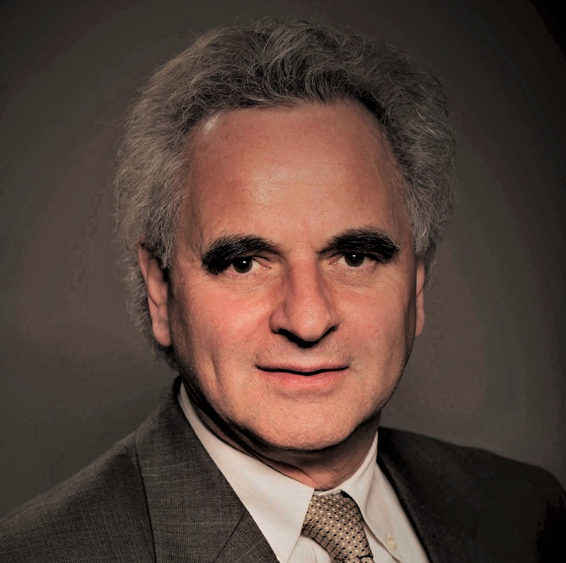
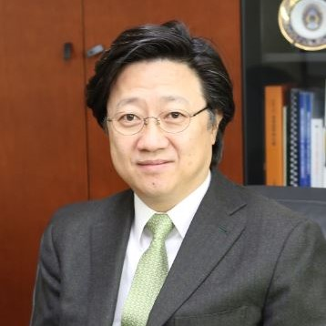
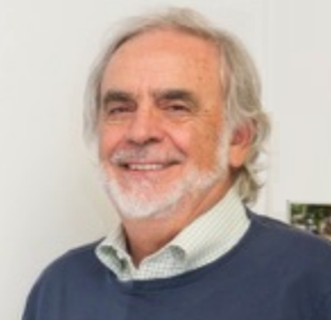
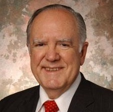

          

            

              
            

          

 

## Synergies of AI and Knowledge Engineering for Healthcare & Biomedicine
#### Nikolaos Bourbakis - Wright State University, USA

<b>Abstract:</b> In  today  complex  computational  environment  and  demanded  IT  responses,  single  based 
methodologies will not offer robust and wide range solutions. Thus, this 
talk 
will  address  how  Synergies  of  AI  and  Knowledge  Engineering  Methodologies  may  offer 
better solutions to some of these major problems in Healthcare & 
Biomedicine. 

<b>Profile:</b>  Dr. Nikolaos Bourbakis (IEEE Fellow-­‐1996) currently is a 
Distinguished Professor of Information & Technology and the Director of 
the Center of Assistive Research Technologies (CART) at Wright State 
University, OH. He is the founder and the EIC of the Int. Journal on AI 
Tools and the Int. Journal on Monitoring and Surveillance 
Tech  Research  (IGI Global), 
the  Founder  and  General  Chair  of  several  International  IEEE 
Computer  Society  Conferences,  Symposia  and Workshops.  

He pursues research  in  Assistive  Technologies,  Applied  AI, 
 Bioengineering,  Information  Security,  and Parallel/Distributed  
Processing  funded  by  USA  andEuropean  government  and  industry. He  
has  extensively  published  in  IEEE  and International  Journals  and  
graduated  several  dozens  of  PhD  students.  His  research  work  
has  been  internationally  recognized  and  won  several  prestigious 
awards.  Some  of  them  are:  IEEE  Computer Society  Technical  
Research  Achievement  Award  1998;  ASC  Outstanding  Scientists  &  
Engineers  Research  Award-­‐2005;  Dr.  F.  Russ  IEEE Biomedical  
Engineering  award,  Dayton  Ohio,  2010;  Most Cited  Article  in  
Pattern  Recognition  Journal,  2006-­‐2010;  IEEE  ICTAI  CV  
Ramamoorthy  best  paper  Award  2012  &  2015;  Recognition  Award for  
his  Outstanding  Scholarly  Achievements  and Contributions  in  the  
field  of  Computer  Science,  UNIPI-­‐GR,  2013;  IEEE  EMBS-­‐GR  
Award  of  Achievements,  2013;  IEEE  Computer  Society  28  years  
ICTAI Outstanding  Service  &  Leadership Recognition, 2016 and others.

 <!-- ------------------------------- -->

          

            

              
            

          

 

## Integrating Artificial Intelligence Capabilities into Deployable Systems
#### Paul Conoval - Northrop Grumman Corporation, Virginia, USA

 <!-- ------------------------------- -->

          

            

              
            

          

 

## Computing Medicine
#### Ophir Frieder - Georgetown University, USA

<b>Abstract:</b> Computing continues to change the landscape of nearly all 
domains, medicine included.  For instance, drug resistance is predicted 
and avoided via data mining applications; radiological reading errors 
are detected and prevented via natural language processing; and disease 
outbreak is detected early via text mining techniques.  These are but 
just some examples where computer intelligence is reshaping medical 
practice.  Specifically, we describe the monitoring of social media to 
detect disease outbreak and describe the implications of such 
surveillance schemes to healthcare planning for a major children-focused 
hospital.  We continue by describing how conventional mining approaches 
significantly improve urinary tract infection treatment plans as 
developed jointly with and for another major hospital. Finally, we 
describe automated means for the detection of differences in 
radiological readings and describe how such detection schemes are used 
in yet a third major hospital.

<b>Profile:</b> Ophir Frieder holds the Robert L. McDevitt, K.S.G., K.C.H.S. 
and Catherine H. McDevitt L.C.H.S. Chair in Computer Science and 
Information Processing and previously served as the Chair of the 
Department of Computer Science at Georgetown University. He is also 
Professor of Biostatistics, Bioinformatics and Biomathematics in the 
Georgetown University Medical Center. In addition to his academic 
positions, he is the Chief Scientific Officer for UMBRA Health 
Corp.(UHC) and a Research Associate at the Institute of Information 
Science and Technology at the Italian National Research Council 
(ISTI-CNR). He is a Fellow of the AAAS, ACM, IEEE, and NAI, and a Member 
of the European Academy of Sciences and Arts. 

 <!-- ------------------------------- -->

          

            

              
            

          

 

## Bringing AI into Fashion
#### Sang-goo Lee - Seoul National University (SNU), South Korea

<b>Abstract:</b> The size of the global fashion market is estimated to reach $3
Trillion in 2018. This is larger than the automotive market and almost 7
times larger than the semi-conductor market. Despite its scope and
glamourous contents, the industry has been relatively low tech (in terms
of IT) and slow to move online. The nuances of style and finely
segmented products make keyword-oriented search inadequate resulting in
ineffective and often inaccurate recommendations. In response to such
shortcomings, many attempts are being made to integrate big data
analytics and social recommendations into fashion e-commerce. Further,
there has been a steady increase in applications of deep learning
oriented visual intelligence for a more refined search and user
experience. In this talk, I will review some of the recent efforts in
the field and introduce my team’s current research activities in
vectorising visual style features of fashion items.

<b>Profile:</b> Sang-goo Lee is a professor of Computer Science & Engineering
at Seoul National University (SNU), Seoul, Korea. His research interests
are in context-aware personalization, natural language processing, and
application of A.I. to business problems. The Korean language parser
KKMA, which he developed with his students, is one of the most widely
used parser in the country. He is the CEO/CTO of IntelliSys, an AI
startup he founded in 2017 specializing in fashion search and
recommendation.

[http://ids.snu.ac.kr/site/members/M_Sang-goo_Lee.html](http://ids.snu.ac.kr/site/members/M_Sang-goo_Lee.html)

 <!-- ------------------------------- -->

          

            

              
            

          

 

## Secure Data Science: Integrating Data Science and Cyber Security
#### Bhavani Thuraisingham - University of Texas, Dallas, USA

 <!-- ------------------------------- -->

          

            

              
            

          

 

## Declarative Programming of Knowledge-based Applications on BigData
#### Carlo Zaniolo - University of California, Los Angeles, USA

<b>Profile:</b> Carlo Zaniolo was born in Vicenza, Italy. He received an E.E. Engineer degree at Padua University in 1968, and M.S. and Ph.D. degrees in Computer Science at UCLA in 1970 and 1976, respectively. After working at Bell Laboratories, Murray Hill, NJ, and MCC in Austin Texas, Dr. Zaniolo joined the UCLA CS Department in 1991, and was awarded the N.E. Friedmann Chair in Knowledge Science. Dr. Zaniolo's interests include big data and knowledge based systems, non-monotonic and temporal reasoning,  internet information systems, answering questions, queries and searches in knowledge bases.</b>

[http://web.cs.ucla.edu/~zaniolo/](http://web.cs.ucla.edu/~zaniolo/)

 <!-- ------------------------------- -->

          

            

              
            

          

 

## Being Transdisciplinary: The Art of Making Meaningful Connections
#### Reymond Yeh - University of Maryland (ret.), College Park, USA, now a long term volunteer at the City of ten thousand Buddhas

 <!-- ------------------------------- -->

          

            

              
            

          

 

## Distinguished AIKE Tutorial @ AIKE 2018
#### Oscar N. Garcia - University of North Texas, USA

<b>Profile:</b> 

Professor of Electrical Engineering, College of Engineering, January, 2008- date Visiting Professor at  the University of Texas, Arlington, Summer, 2008 Founding Dean of the new College of Engineering, University of North Texas, Denton, TX, July 2003 – 2008.

NCR Endowed Distinguished Professor and Chair, Department of Computer Science and Engineering, College of Engineering and Computer Science, Wright State University (WSU), Dayton, OH, January 1995 – June 2003.

Interim Director, Information Technology Research Institute, Wright State University, College of Engineering, (while NCR Distinguished Professor and Chair of CSE), July 1, 2000 – February 1, 2001.

Doctoral Program Director for Computer Science and Engineering and a member of the Graduate Council (1996-1997) at Wright State University.

Program Director for Interactive Systems in the Information, Robotics, and Intelligent Systems Division of the CISE Directorate at the National Science Foundation (NSF), while on IPA leave from George Washington University (GWU), September 1992 – December 1995.

Professor, Department of Electrical Engineering and Computer Science, September 1985 – May 1995 (on leave while IPA at NSF and at WSU for the last 3-year period), The George Washington University, School of Engineering and Applied Science, Washington, DC.

Visiting Professor (on sabbatical from GWU) at the University of Maryland Institute for Advanced Computer Studies (UMIACS) at the Center for Automation and Robotics from July 1988 – June 1989.

Charter Chairman, Department of Computer Science and Engineering (a newly formed department), University of South Florida, February 1979 – August 1985.
Program Director (IPA), responsible for Instructional Scientific Equipment (ISE) and Local Course Improvement (LOCI) Programs, Science Education Directorate, National Science Foundation, September 1977 – June 1978 while on leave from the University of South Florida.

Professorial Lecturer (part-time, while full time Program Director at NSF's Education and Human Resources Directorate), Department of Electrical Engineering, The George Washington University, Washington, DC, January 1978.

Professor, University of South Florida, September 1975 – August 1985.

Assistant Chairman, Department of Electrical Engineering, University of South Florida, in charge of BS, MS, and Ph.D. programs in the Computer Science option of an Engineering Science degree, December 1974 – February 1979.

Associate Professor, University of South Florida, Department of Electrical Engineering, June 1970 – June 1975.

Associate Professor, Old Dominion University, Department of Electrical Engineering, September 1969 – July 1970.

Research Assistant and Instructor, University of Maryland, Department of Electrical Engineering, September 1966 – September 1969.  PhD awarded in EE in 1969.

Assistant Professor, Old Dominion University, Department of Electrical Engineering, September 1963 – September 1966.

